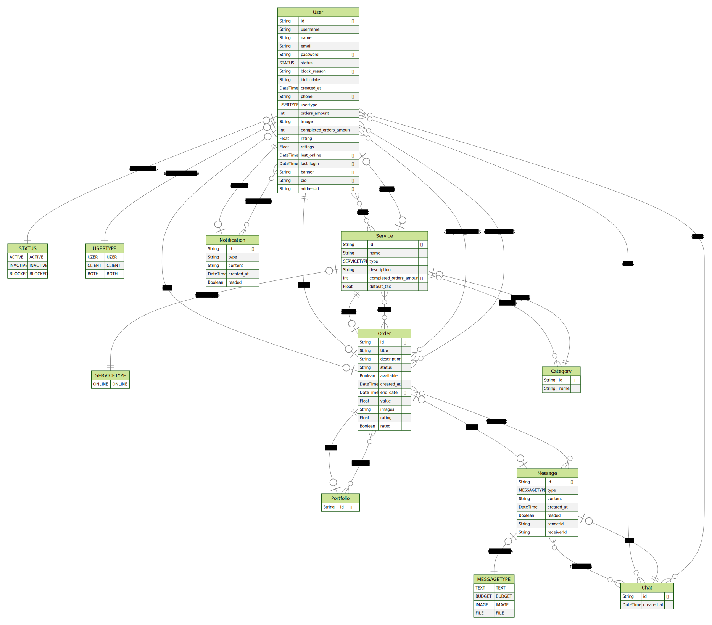

# uez-api

A uez api é uma aplicação de **networkring**.

A ferramenta permite que um usuário se cadastre seja como o prestador de serviços(Uzer), ou alguém que necessita de um serviço(Cliente).

Os Clientes podem criar Pedidos de serviços, que serão assimiladas á algum Uzer competente, e finalizado..

O sistema gerenciará todo o fluxo, permitindo com que o Cliente possa acompanhar o andamento do seu Pedido, e o Uzer não precisará se preocupar com mais nada além de concluir seu serviço.

## Requisitos

### Requisitos funcionais

- [x] O usuário deve poder se cadastrar como Cliente;
- [x] O usuário deve poder se cadastrar como Uzer;
- [x] O Cliente deve poder criar um Pedido;
- [x] O Cliente deve poder visualizar a lista de Uzers;
- [x] O Uzer deve poder visualizar a lista de Pedidos;
- [x] O Uzer deve poder se "encarregar" de um Pedido;
- [x] O Uzer deve poder finalizar o Pedido;
- [x] O Cliente deve poder avaliar o Pedido;
- [x] O Cliente deve poder avaliar o Uzer que realizou seu Pedido;

### Regras de negócio

- [x] O usuário que se cadastra, deve poder escolher apenas uma opção de usuário (Uzer ou Cliente);
- [x] O Pedido só pode ter um único Uzer atrelado a ele;
- [x] O Pedido só deve ser dado como concluido, quando o cliente avalia-lo;

### Requisitos não-funcionais

- [x] O cadastro do pode ser feito via Google;

## Documentação da API (Swagger)

Para documentação da API, acesse o link: [https://api.uezcompany.com/docs](https://api.uezcompany.com/docs)

## Banco de dados

Nessa aplicação vamos utilizar banco de dados relacional (SQL). Para ambiente de desenvolvimento seguiremos com o PostgreSQL pela facilidade do ambiente.

### Diagrama ERD

