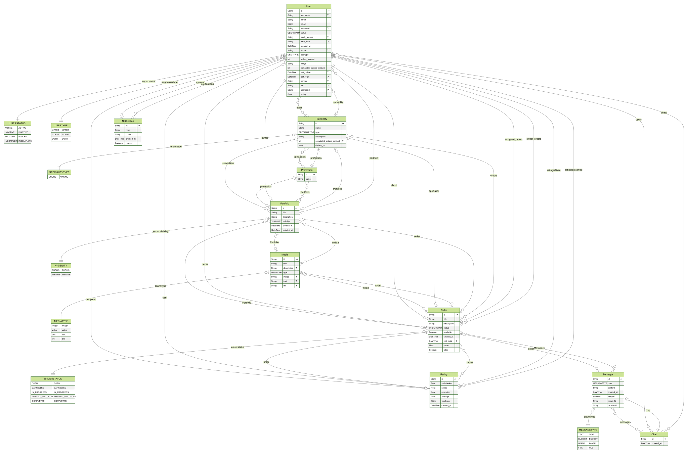

# uez-api

A Uez API é uma aplicação de **networking**.

A ferramenta permite que um usuário cadastre-se, seja como o prestador de serviços (Uezer), ou alguém que necessita de um serviço (Cliente).

Os Clientes podem criar Pedidos de alguma Especialidade, que serão assimiladas á algum Uezer competente, e finalizado..

O sistema gerenciará todo o fluxo, permitindo com que o Cliente possa acompanhar o andamento do seu Pedido, e o Uezer não precisará se preocupar com mais nada além de concluir seu serviço.

## Como rodar a aplicação

Antes de mais nada, certifique-se de ter o `pnpm` instalado, e também configure as variáveis de ambiente seguindo o `env.ts`

### Em ambiente de desenvolvimento

- Execute o comando: `docker compose up -d`, para criar e iniciar o container docker responsavel pelo banco de dados postgres.

- Depois, execute o `pnpm install` para instalar as dependências do projeto, e o `pnpm husky:prepare` para configurar o git hooks.

- Em seguida, rode o `pnpm migrate` para criar as tabelas no banco de dados, e o `pnpm seed:dev` para popular as tabelas.

- Por fim, rode o `pnpm dev` para iniciar a aplicação.

## Requisitos

### Requisitos funcionais

- [x] O usuário deve poder se cadastrar como Cliente;
- [x] O usuário deve poder se cadastrar como Uezer;
- [x] O Cliente deve poder criar um Pedido;
- [x] O Cliente deve poder visualizar a lista de Uezers;
- [x] O Uezer deve poder visualizar a lista de Pedidos;
- [x] O Uezer deve poder se "encarregar" de um Pedido;
- [x] O Uezer deve poder finalizar o Pedido;
- [x] O Cliente deve poder avaliar o Pedido;
- [x] O Cliente deve poder avaliar o Uezer que realizou seu Pedido;

### Regras de negócio

- [x] O usuário que se cadastra, deve poder escolher apenas uma opção de usuário (Uezer ou Cliente);
- [x] O Pedido só pode ter um único Uezer atrelado a ele;
- [x] O Pedido só deve ser dado como concluido, quando o cliente avalia-lo;

### Requisitos não-funcionais

- [x] O cadastro pode ser feito via Google;

## Documentação da API (Swagger)

Para acessar a documentação da API, acesse o link: [https://api.uezcompany.com/docs](https://api.uezcompany.com/docs)

## Banco de dados

Nessa aplicação utilizamos o PostgreSQL como banco de dados. Para ambiente de desenvolvimento seguiremos com o PostgreSQL pela facilidade de configuração via docker.

### Diagrama ERD

